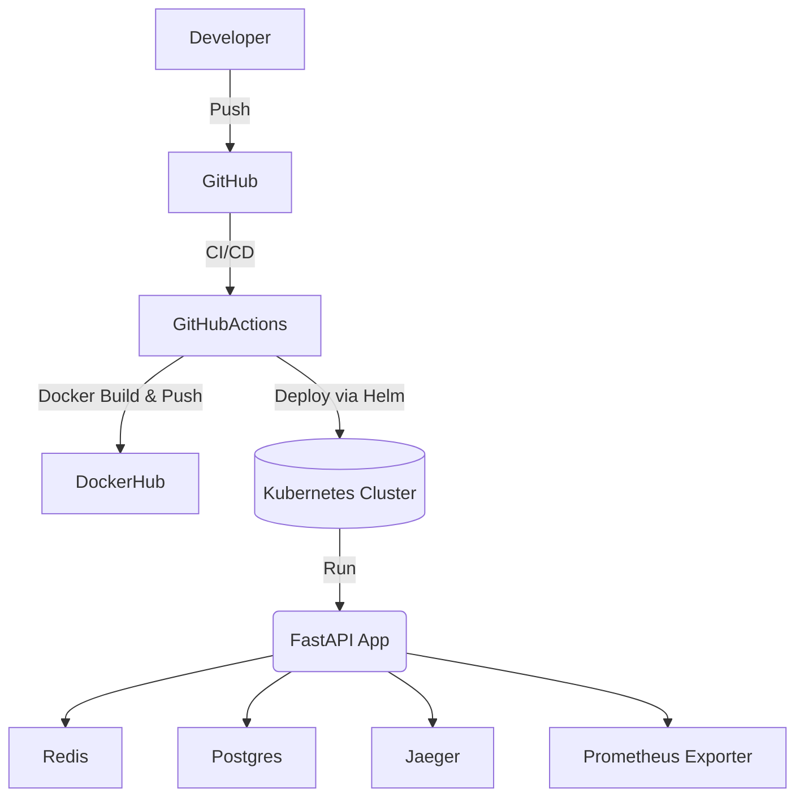

# Rick and Morty SRE Application

A highly available, scalable, and production-grade RESTful application that integrates with the [Rick and Morty API](https://rickandmortyapi.com/). Built with SRE and DevOps best practices in mind, and deployed on Kubernetes using Helm and GitHub Actions.

---

## 📌 Table of Contents

- [Overview](#overview)
- [Architecture](#architecture)
- [Features](#features)
- [Technology Stack](#technology-stack)
- [Setup & Deployment](#setup--deployment)
  - [Local Development](#local-development)
  - [Kubernetes Deployment](#kubernetes-deployment)
- [API Documentation](#api-documentation)
- [Health Check](#health-check)
- [Monitoring & Observability](#monitoring--observability)
- [CI/CD Pipeline](#cicd-pipeline)
- [Helm Chart Configuration](#helm-chart-configuration)
- [Testing](#testing)
- [Security](#security)
- [Contributing](#contributing)
- [License](#license)

---

## ✅ Overview

This application queries the Rick and Morty API to fetch alive human characters originating from Earth (any variant), caches the result in Redis with TTL, persists the data into PostgreSQL, and exposes RESTful APIs with pagination, sorting, and health endpoints.

---

## 📐 Architecture



## 🚀 Features

- **Filters**: `Species=Human`, `Status=Alive`, `Origin=Earth*`
- **API rate limit handling** with retries
- **Redis caching** with TTL
- **PostgreSQL** persistence
- **REST API** with pagination and sorting
- **Prometheus metrics** & distributed tracing (OpenTelemetry)
- **Horizontal Pod Autoscaling** & TLS Ingress
- **GitHub Actions CI/CD** with `kind` + Helm
- **Log aggregation sidecar** (Fluentd/Filebeat)

## 🧰 Technology Stack

| Layer            | Tech                                        |
|------------------|---------------------------------------------|
| Language          | Python 3.11 (FastAPI) / Go                  |
| API Framework     | FastAPI / Gin                               |
| Database          | PostgreSQL                                  |
| Cache             | Redis                                       |
| Containerization  | Docker + multi-stage build                  |
| Orchestration     | Kubernetes + Helm                           |
| CI/CD             | GitHub Actions + kind                       |
| Monitoring        | Prometheus, Grafana, OpenTelemetry, Jaeger  |
| Logging           | Fluentd or Filebeat                         |
| Rate Limiting     | SlowAPI / Custom Middleware                 |

## 🧪 Setup & Deployment

### ⚙️ Local Development

```bash
git clone https://github.com/yourusername/rick-and-morty-sre.git
cd rick-and-morty-sre

cp .env.example .env
docker-compose up --build
```

### 🔗 Access Endpoints

After running the app locally with `docker-compose` or deploying it to Kubernetes, access the application at:

- **API**: [http://localhost:8000/characters](http://localhost:8000/characters)  
- **Metrics**: [http://localhost:8000/metrics](http://localhost:8000/metrics)  
- **Health Check**: [http://localhost:8000/healthcheck](http://localhost:8000/healthcheck)

## ☸️ Kubernetes Deployment (using Helm)

```bash
# Prerequisites
kubectl config use-context kind-kind
helm repo add stable https://charts.helm.sh/stable

# Deploy the app
helm upgrade --install rick-api ./charts/rick-api \
  --values charts/rick-api/values.yaml

kubectl get all -n rick-api
```

## 📖 API Documentation

API documentation is available at:

- 🔹 [`/docs`](http://localhost:8000/docs) – Swagger UI  
- 🔹 [`/openapi.json`](http://localhost:8000/openapi.json) – OpenAPI Spec

---

### 📦 Sample Endpoint

```http
GET /characters?page=1&limit=5&sort=name
```

### 🧮 Query Parameters

| Parameter | Type   | Required | Description                            |
|-----------|--------|----------|----------------------------------------|
| `page`    | int    | No       | Page number (default: 1)               |
| `limit`   | int    | No       | Items per page (default: 10)           |
| `sort`    | string | No       | Sort by `name` or `id` (default: `id`) |

### 🧾 Sample JSON Response

```json
{
  "page": 1,
  "total": 86,
  "results": [
    {
      "id": 1,
      "name": "Rick Sanchez",
      "status": "Alive",
      "species": "Human",
      "origin": "Earth (C-137)",
      "image": "https://rickandmortyapi.com/api/character/avatar/1.jpeg"
    },
    {
      "id": 2,
      "name": "Morty Smith",
      "status": "Alive",
      "species": "Human",
      "origin": "Earth (C-137)",
      "image": "https://rickandmortyapi.com/api/character/avatar/2.jpeg"
    }
  ]
}
```

## 🩺 Health Check

**Endpoint**: `GET /healthcheck`

Performs checks for:

- ✅ Redis connection  
- ✅ PostgreSQL status  
- ✅ External Rick & Morty API availability  

### 🧾 Example Response

```json
{
  "status": "healthy",
  "redis": "ok",
  "postgres": "ok",
  "external_api": "ok"
}
```

## 📊 Monitoring & Observability

### 🔍 Metrics

- Exposed at: `/metrics` (Prometheus format)
- Custom metrics include:
  - `characters_processed_total`
  - `cache_hit_ratio`
  - `http_request_duration_seconds`

➡️ Dashboard exported as: `docs/grafana-dashboard.json`

---

### 📈 Tracing

- Integrated with **OpenTelemetry** and **Jaeger** for distributed tracing.

---

### 🚨 Alerts

Defined in `PrometheusRule`:

- **HighErrorRate**: HTTP 5xx error rate > 5%
- **LatencySpike**: P95 latency > 500ms
- **CrashLoopBackoff**: More than 3 restarts within 5 minutes

---

## 🔁 CI/CD Pipeline

GitHub Actions workflow: `.github/workflows/ci.yml`

### ✅ Pipeline Steps

- ✅ Lint, Unit + Integration Tests  
- ✅ Build & Push Docker image  
- ✅ Deploy to `kind` with Helm  
- ✅ Validate endpoints  
- ✅ Upload test logs  

---

## ⚙️ Helm Chart Configuration

| Key                   | Default | Description                          |
|------------------------|---------|--------------------------------------|
| `replicaCount`         | 2       | Number of application pods           |
| `cache.ttl`            | 300     | Redis cache TTL in seconds           |
| `ingress.enabled`      | true    | Enable ingress                       |
| `resources.limits.cpu` | 500m    | CPU limit                            |
| `tracing.enabled`      | true    | Enable Jaeger tracing                |

## 🧪 Testing

Run tests using `pytest`:

```bash
# Run all tests
pytest tests/

# Run integration tests only
pytest tests/test_api.py
```

## 🔒 Security

- 🔐 Uses **Kubernetes Secrets** for managing sensitive environment variables
- 🛡️ Docker image scanning via **Trivy** integrated in the CI pipeline
- 📁 `.env.example` is provided; **real secrets are excluded** from the repository
