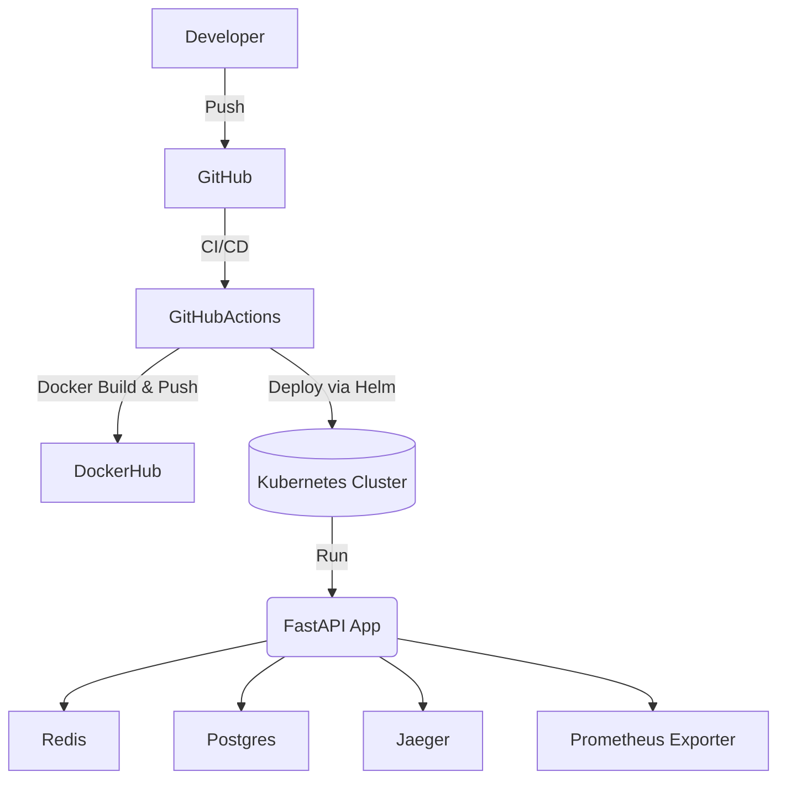
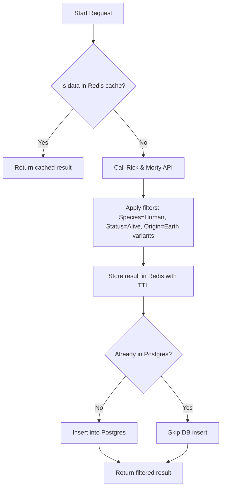
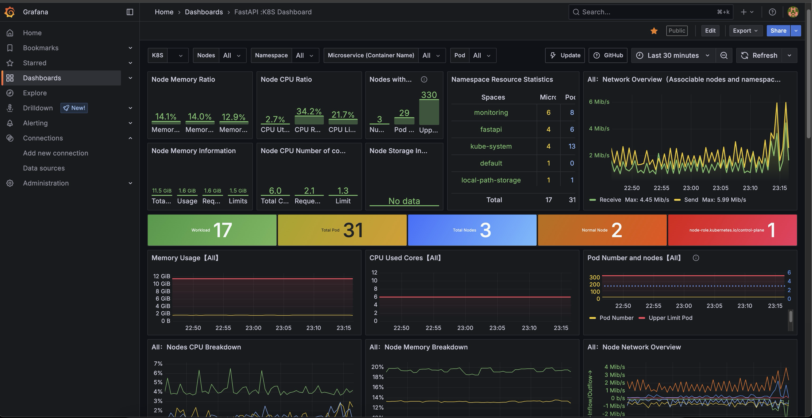
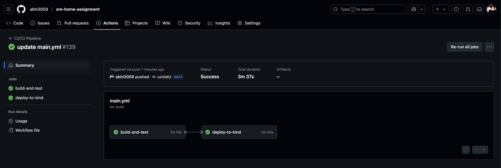

Asdas


# 🧬 Rick and Morty SRE Application

A highly available, scalable, production-grade RESTful API that integrates with the [Rick and Morty API](https://rickandmortyapi.com/).  
Engineered with modern **SRE** and **DevOps** best practices — deployed on Kubernetes using Helm and GitHub Actions.

---

## 📚 Table of Contents

- [✅ Overview](#✅-overview)
- [🏗️ Architecture](#📐-architecture)
- [🚀 Features](#🚀-features)
- [🧰 Technology Stack](#🧰-technology-stack)
- [🧪 Setup & Deployment](#🧪-setup--deployment)
  - [⚙️ Local Development](#⚙️-local-development)
  - [☸️ Kubernetes Deployment](#☸️-kubernetes-deployment-using-helm)
- [📖 API Documentation](#📖-api-documentation)
- [🩺 Health Check](#🩺-health-check)
- [📊 Monitoring & Observability](#📊-monitoring--observability)
- [🔁 CI/CD Pipeline](#🔁-cicd-pipeline)
- [⚙️ Helm Chart Configuration](#⚙️-helm-chart-configuration)
- [🧪 Testing](#🧪-testing-1)
- [🔒 Security](#🔒-security)
- [🤝 Contributing](#🤝-contributing)
- [🪪 License](#🪪-license)

---


## ✅ Overview

This service queries the Rick and Morty API to fetch alive, human characters from Earth-based origins.  
The results are cached in **Redis**, persisted in **PostgreSQL**, and served via a **FastAPI** interface with sorting, pagination, and retry logic.


## 🏗️ Architecture



Architecture
## 🚀 Features 

- 🔍 Filters: `Species=Human`, `Status=Alive`, `Origin=Earth*`
- 🔁 API rate limiting & retries
- 💾 Redis caching with TTL
- 🗃️ PostgreSQL persistence
- 📡 REST API with pagination & sorting
- 📈 Prometheus metrics + OpenTelemetry tracing
- ⚖️ HPA, TLS ingress support
- 🧪 GitHub Actions CI/CD with kind + Helm
- 📥 Fluentd/Filebeat log aggregation


## 🧰 Technology Stack

| Layer            | Tech                                        |
|------------------|---------------------------------------------|
| Language          | Python 3.11 (FastAPI) / Go                  |
| API Framework     | FastAPI / Gin                               |
| Database          | PostgreSQL                                  |
| Cache             | Redis                                       |
| Containerization  | Docker + multi-stage build                  |
| Orchestration     | Kubernetes + Helm                           |
| CI/CD             | GitHub Actions + kind                       |
| Monitoring        | Prometheus, Grafana, OpenTelemetry, Jaeger  |
| Logging           | Fluentd or Filebeat                         |
| Rate Limiting     | SlowAPI / Custom Middleware                 |


## 🧪 Setup & Deployment

### ⚙️ Local Development

```bash
# Prerequisites
kubectl config use-context kind-kind
helm repo add stable https://charts.helm.sh/stable


# Deploy the app with specified namespace, image repo/tag
helm upgrade --install fastapi-app ../../helm-chart \
  --namespace fastapi \
  --create-namespace \
  --set image.repository=abhi3059/fastapi-app \
  --set image.tag=latest 
```

# Get all resources in the 'fastapi' namespace
kubectl get all -n fastapi


```
root@localhost:~/sre-home-assignment/manifest/k8s# kubectl get all -n fastapi

NAME                                 READY   STATUS      RESTARTS   AGE
pod/fastapi-app-58c88449cd-k9hnt     2/2     Running     0          19m
pod/fastapi-app-58c88449cd-smmkr     2/2     Running     0          19m
pod/otel-collector-65df48876-hf6sn   1/1     Running     0          49m
pod/postgres-7df87f58f9-vpd6z        1/1     Running     0          3d3h
pod/rbac-test                        0/1     Completed   0          2d23h
pod/redis-66949686f7-rzrjh           1/1     Running     0          3d3h

NAME                     TYPE        CLUSTER-IP      EXTERNAL-IP   PORT(S)    AGE
service/fastapi-app      ClusterIP   10.96.238.110   <none>        80/TCP     3d4h
service/otel-collector   ClusterIP   10.96.160.241   <none>        4318/TCP   3h2m
service/postgres         ClusterIP   10.96.39.49     <none>        5432/TCP   3d2h
service/redis            ClusterIP   10.96.41.38     <none>        6379/TCP   3d3h

NAME                             READY   UP-TO-DATE   AVAILABLE   AGE
deployment.apps/fastapi-app      2/2     2            2           3d4h
deployment.apps/otel-collector   1/1     1            1           3h2m
deployment.apps/postgres         1/1     1            1           3d3h
deployment.apps/redis            1/1     1            1           3d3h

NAME                                       DESIRED   CURRENT   READY   AGE
replicaset.apps/fastapi-app-557cdbd5f6     0         0         0       38m
replicaset.apps/fastapi-app-58c88449cd     2         2         2       19m
replicaset.apps/fastapi-app-5bf656b985     0         0         0       21m
replicaset.apps/fastapi-app-5f69bf5c57     0         0         0       64m
replicaset.apps/fastapi-app-69d66bdfcf     0         0         0       2d1h
replicaset.apps/fastapi-app-6d794c8548     0         0         0       50m
replicaset.apps/fastapi-app-6fd544b5d9     0         0         0       31m
replicaset.apps/fastapi-app-75fcbc9d5c     0         0         0       30m
replicaset.apps/fastapi-app-7dcc885f8c     0         0         0       41m
replicaset.apps/fastapi-app-86d76744b      0         0         0       21m
replicaset.apps/fastapi-app-b844fbcf6      0         0         0       51m
replicaset.apps/otel-collector-65df48876   1         1         1       49m
replicaset.apps/otel-collector-f7bd5d6     0         0         0       3h2m
replicaset.apps/postgres-7df87f58f9        1         1         1       3d3h
replicaset.apps/redis-66949686f7           1         1         1       3d3h

NAME                                              REFERENCE                TARGETS   MINPODS   MAXPODS   REPLICAS   AGE
horizontalpodautoscaler.autoscaling/fastapi-app   Deployment/fastapi-app   0%/70%    2         5         2          3d4h
```


## 🔗 Access Endpoints

| Endpoint        | Description             | URL                                  |
|----------------|-------------------------|--------------------------------------|
| 🧬 API          | Character listing        | [`/characters`](http://localhost/characters) |
| 📈 Metrics      | Prometheus metrics       | [`/metrics`](http://localhost/metrics)       |
| 🩺 Health Check | Service health status    | [`/healthcheck`](http://localhost/healthcheck) |


## 📖 API Documentation

API documentation is available at:

- 🔹 [`/docs`](http://172.236.172.53/docs#/) – Swagger UI  
- 🔹 [`/openapi.json`](http://172.236.172.53/openapi.json) – OpenAPI Spec


## 📖 API TYPICAL FLOW




### 📦 Sample Endpoint

```http
GET /characters?page=1&limit=5&sort=name
```

### 🧮 Query Parameters

| Parameter | Type   | Required | Description                            |
|-----------|--------|----------|----------------------------------------|
| `page`    | int    | No       | Page number (default: 1)               |
| `limit`   | int    | No       | Items per page (default: 10)           |
| `sort`    | string | No       | Sort by `name` or `id` (default: `id`) |

### 🧾 Sample JSON Response

```json
{
  "page": 1,
  "total": 86,
  "results": [
    {
      "id": 1,
      "name": "Rick Sanchez",
      "status": "Alive",
      "species": "Human",
      "origin": "Earth (C-137)",
      "image": "https://rickandmortyapi.com/api/character/avatar/1.jpeg"
    },
    {
      "id": 2,
      "name": "Morty Smith",
      "status": "Alive",
      "species": "Human",
      "origin": "Earth (C-137)",
      "image": "https://rickandmortyapi.com/api/character/avatar/2.jpeg"
    }
  ]
}
```

### 🧮 POSTGRES DATABASE

```
root@localhost:~/sre-home-assignment/manifest/k8s# kubectl get pods -n fastapi
NAME                             READY   STATUS      RESTARTS   AGE
postgres-7df87f58f9-vpd6z        1/1     Running     0          3d4h
root@localhost:~/sre-home-assignment/manifest/k8s#

======== ACCESS POSTGRES DATABASE =========

root@localhost:~/sre-home-assignment/manifest/k8s# kubectl exec -it postgres-7df87f58f9-vpd6z -n fastapi -- bash
postgres-7df87f58f9-vpd6z:/# psql -U postgres -d rickmorty
psql (15.13)
Type "help" for help.

rickmorty=# \dn
      List of schemas
  Name  |       Owner
--------+-------------------
 public | pg_database_owner
(1 row)

rickmorty=# \dt public.*
           List of relations
 Schema |    Name    | Type  |  Owner
--------+------------+-------+----------
 public | characters | table | postgres
(1 row)

rickmorty=#
rickmorty=#
rickmorty=# Select * from characters;
 id  |      name       | status | species |                   origin
-----+-----------------+--------+---------+--------------------------------------------
  37 | Beth Sanchez    | Alive  | Human   | Earth (C-500A)
  38 | Beth Smith      | Alive  | Human   | Earth (C-137)
  39 | Beth Smith      | Alive  | Human   | Earth (Evil Rick's Target Dimension)
   1 | Rick Sanchez    | Alive  | Human   | Earth (C-137)
   3 | Summer Smith    | Alive  | Human   | Earth (Replacement Dimension)
   4 | Beth Smith      | Alive  | Human   | Earth (Replacement Dimension)
   5 | Jerry Smith     | Alive  | Human   | Earth (Replacement Dimension)
  17 | Annie           | Alive  | Human   | Earth (C-137)
  45 | Bill            | Alive  | Human   | Earth (C-137)
  58 | Brad            | Alive  | Human   | Earth (Replacement Dimension)
  72 | Cool Rick       | Alive  | Human   | Earth (K-83)
 166 | Invisi-trooper  | Alive  | Human   | Earth (Replacement Dimension)
 169 | Jacob           | Alive  | Human   | Earth (C-137)
 170 | Jacqueline      | Alive  | Human   | Earth (Replacement Dimension)
 171 | Jaguar          | Alive  | Human   | Earth (Replacement Dimension)
 172 | Jamey           | Alive  | Human   | Earth (Replacement Dimension)
 174 | Jerry 5-126     | Alive  | Human   | Earth (5-126)
 175 | Jerry Smith     | Alive  | Human   | Earth (C-137)
 176 | Celebrity Jerry | Alive  | Human   | Earth (C-500A)
 177 | Jerry Smith     | Alive  | Human   | Earth (Evil Rick's Target Dimension)
 180 | Jessica         | Alive  | Human   | Earth (Replacement Dimension)
  88 | Cynthia         | Alive  | Human   | Earth (Replacement Dimension)
  91 | David Letterman | Alive  | Human   | Earth (C-500A)
 160 | Hunter's Father | Alive  | Human   | Earth (Giant Telepathic Spiders Dimension)
 107 | Dr. Wong        | Alive  | Human   | Earth (Replacement Dimension)
 112 | Eric McMan      | Alive  | Human   | Earth (C-137)
 115 | Ethan           | Alive  | Human   | Earth (Replacement Dimension)
 241 | Mr. Marklovitz  | Alive  | Human   | Earth (C-137)
 245 | Mrs. Lipkip     | Alive  | Human   | Earth (Replacement Dimension)
 246 | Mrs. Pancakes   | Alive  | Human   | Earth (C-137)
 251 | Nancy           | Alive  | Human   | Earth (Replacement Dimension)
 255 | Orthodox Jew    | Alive  | Human   | Earth (Replacement Dimension)
 288 | Rick D716-B     | Alive  | Human   | Earth (D716-B)
 289 | Rick D716-C     | Alive  | Human   | Earth (D716-C)
 291 | Rick J-22       | Alive  | Human   | Earth (J-22)
 292 | Rick K-22       | Alive  | Human   | Earth (K-22)
(36 rows)

rickmorty=#

```

## 🩺 Health Check

**Endpoint**: `GET /healthcheck`

Performs checks for:

- ✅ Redis connection  
- ✅ PostgreSQL status 

### 🧾 Example Response

```json
{
  "database": true,
  "redis": true
}
```

## RBAC Validation: 

```
——RBAC VALIDATION 

root@localhost:~/sre-home-assignment/manifest/k8s# kubectl get pods -n fastapi
NAME                             READY   STATUS      RESTARTS   AGE
rbac-test                        0/1     Completed   0          3d1h
root@localhost:~/sre-home-assignment/manifest/k8s#

root@localhost:~/sre-home-assignment/manifest/k8s# kubectl get pod rbac-test -n fastapi -o jsonpath='{.spec.containers[*].name}'
kubectl
root@localhost:~/sre-home-assignment/manifest/k8s#

root@localhost:~/sre-home-assignment/manifest/k8s# kubectl exec -n fastapi -c kubectl -it rbac-test -- /bin/sh
$ kubectl get pods -n fastapi
NAME                           READY   STATUS    RESTARTS   AGE
fastapi-app-7779454577-2fhrq   2/2     Running   0          12m
fastapi-app-7779454577-997r6   2/2     Running   0          12m
postgres-7df87f58f9-vpd6z      1/1     Running   0          3h44m
rbac-test                      1/1     Running   0          3m30s
redis-66949686f7-rzrjh         1/1     Running   0          3h44m
$
```


### HPA Testing for fastapi-App


1. Check HPA Status

  Run the following to confirm the current target CPU and metrics:
```
kubectl get hpa fastapi-app -n fastapi

NAME          REFERENCE                TARGETS    MINPODS   MAXPODS   REPLICAS   AGE
fastapi-app   Deployment/fastapi-app   0%/70%     2         5         2          3d6h

```

2. Simulate CPU Load

  On one of the pods (e.g., fastapi-app-58c88449cd-k9hnt) and running a CPU-intensive process:
```
kubectl exec -n fastapi -it fastapi-app-58c88449cd-k9hnt -- sh

Exec in side the pod (fastapi-app-58c88449cd-k9hnt)
yes > /dev/null
```

3. Monitor the HPA Respond

```
Every 5.0s: kubectl get hpa fastapi-app -n fastapi                                                                                                                                                              localhost: Thu Jul  3 18:33:27 2025

NAME          REFERENCE                TARGETS   MINPODS   MAXPODS   REPLICAS   AGE
fastapi-app   Deployment/fastapi-app   30%/70%    2         5         2          3d6h
```

4. Clean-up 

  Stop the CPU load after observing scaling:
```
Exec in side the pod (fastapi-app-58c88449cd-k9hnt)
killall yes
```


## 📊 Monitoring & Observability

 
#### GRAFANA ACCESS & CREDENTIAL

Grafana URL : http://172.236.172.53:31000/login
```
USER : admin
PASS : prom-operator
```

### 🔍 Grafana Dashboard

FASTAPI Application-Specific Metrics Dashboard (e.g., request latency, cache hit ratio, API error rates). : http://172.236.172.53:31000/d/edbad086-10d0-42a0-a0b1-f80522aab6e7/fastapi-sre-dashboard?orgId=1&from=now-6h&to=now&timezone=browser&refresh=1m

K8S DASHBOARD : http://172.236.172.53:31000/d/24b68a25-8b23-4140-98e7-cef238e14f31/fastapi-3a-k8s-dashboard?orgId=1&from=now-30m&to=now&timezone=browser&var-origin_prometheus=&var-Node=$__all&var-NameSpace=$__all&var-Container=$__all&var-Pod=$__all





#### PROMETHEUS CREDENTIAL

Prometheus URL : http://172.236.172.53:31000/login
```
Note : NO CREDENTIAL REQUIRED
```

### 🔍 Metrics

- Exposed at: `https://172.236.172.53/metrics` (Prometheus format)
- Custom metrics include:
  - `characters_processed_total`
  - `cache_hit_ratio`
  - `http_request_duration_seconds`

➡️ Dashboard exported as: `/observability/grafana/grafana-dashboard.json`

### 📈 Tracing

- Integrated with **OpenTelemetry** 

### 🚨 Alerts

Defined in `PrometheusRule`: http://172.236.172.53:30000/alerts

- **HighErrorRate**: HTTP 5xx error rate > 5%
- **LatencySpike**: P95 latency > 500ms
- **CrashLoopBackoff**: More than 3 restarts within 5 minutes


## 🔁 CI/CD Pipeline

GitHub Actions workflow: `.github/workflows/main.yml`

### ✅ Pipeline Steps

- ✅ Lint, Unit + Integration Tests  
- ✅ Build & Push Docker image  
- ✅ Deploy to `kind` with Helm  
- ✅ Validate endpoints  
- ✅ Upload test logs  


## ⚙️ Helm Chart Configuration

| Key                   | Default | Description                          |
|------------------------|---------|--------------------------------------|
| `replicaCount`         | 2       | Number of application pods           |
| `cache.ttl`            | 300     | Redis cache TTL in seconds           |
| `ingress.enabled`      | true    | Enable ingress                       |
| `resources.limits.cpu` | 500m    | CPU limit                            |
| `tracing.enabled`      | true    | Enable  OpenTelemetry                |


## 🧪 Testing

Run tests using `pytest`:

```bash
# Run all tests
pytest tests/

# Run integration tests only
pytest tests/test_api.py
```


## 🔒 Security

- 🔐 Uses **Kubernetes Secrets** for managing sensitive environment variables
- 🛡️ Docker image scanning via **Trivy** integrated in the CI pipeline
- 📁 `.env.example` is provided; **real secrets are excluded** from the repository


## CI/CD Pipeline

GitHub Actions workflow defined in `.github/workflows/main.yml`

- [View CI Status Badge](https://github.com/abhi3059/sre-home-assignment/actions/workflows/main.yml/badge.svg)
- [Successful CI Run Log](https://github.com/abhi3059/sre-home-assignment/actions/runs/16057507228)

Screenshots:



--- 